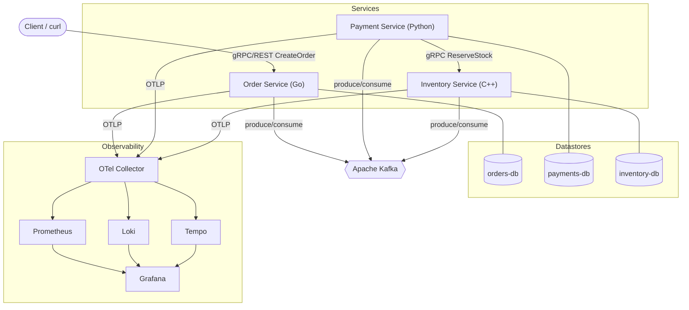
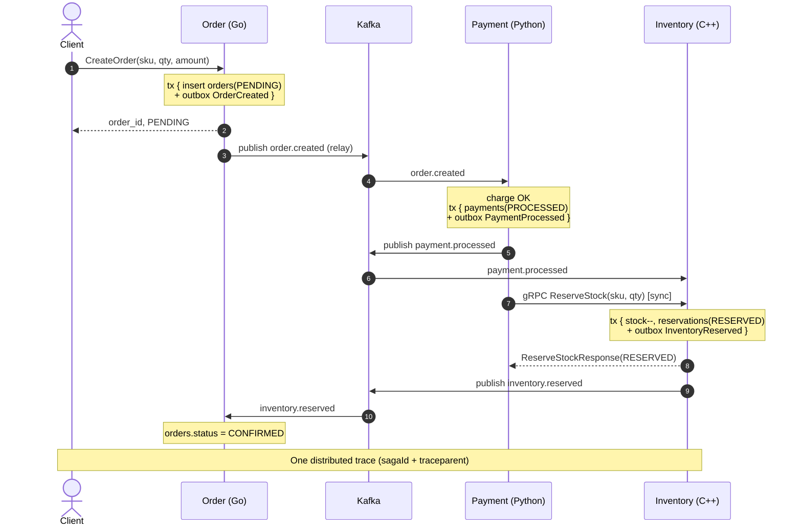
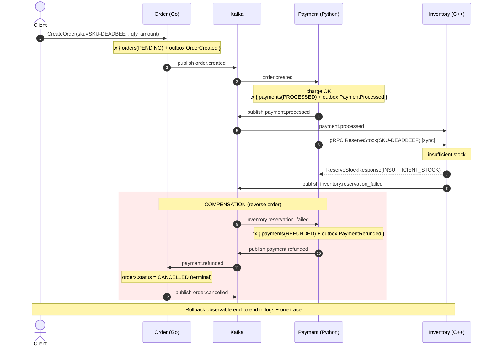

# Choreography Saga Demo

A polyglot, distributed-transaction demo that implements the **Choreography Saga**
pattern across three independently-built microservices. It shows how a business
transaction that spans multiple services and databases stays consistent **without a
central orchestrator** — using compensating transactions to roll back on failure,
a transactional outbox for reliable event publishing, consumer-side idempotency for
at-least-once delivery, durable per-service SQL state, one synchronous strongly-typed
gRPC leg, a Kafka event backbone, and full three-signal observability (metrics, logs,
traces) with trace-to-log correlation. It is intentionally polyglot — **Order in Go,
Payment in Python, Inventory in C++** — to demonstrate that the same saga contract
holds across languages, runtimes, and client libraries.

- Requirements: [docs/requirements/SRS.md](docs/requirements/SRS.md)
- Tech-stack decisions: [docs/tech-stack.md](docs/tech-stack.md)
- Architecture: [docs/design/ARCHITECTURE.md](docs/design/ARCHITECTURE.md)
- Sequence diagrams: [docs/design/sequence-diagram.md](docs/design/sequence-diagram.md)
- QA test report: [docs/testing/choreography-saga-test-report.md](docs/testing/choreography-saga-test-report.md)
- Project status: [docs/status.md](docs/status.md)

---

## Architecture overview

Three autonomous services choreograph an order saga over Kafka. Each owns a private
PostgreSQL database (database-per-service, no shared schema). One step — stock
reservation — is a **synchronous gRPC call** where the caller needs an immediate,
strongly-typed success/failure decision; everything else flows asynchronously as
events.

| Service | Language | Owns | Sync API |
| --- | --- | --- | --- |
| **Order** | Go | orders + saga state (`orders-db`) | inbound gRPC/REST `CreateOrder`, `GetOrder` |
| **Payment** | Python | payments (`payments-db`) | gRPC **client** → Inventory `ReserveStock` |
| **Inventory** | C++ | stock + reservations (`inventory-db`) | inbound gRPC server `ReserveStock`, `ReleaseStock` |

**Kafka topics** (single partition each — per-topic ordering; cross-topic order is not
guaranteed and the Order consumer parks/redelivers premature events):

`order.created`, `payment.processed`, `payment.failed`, `inventory.reserved`,
`inventory.reservation_failed`, `payment.refunded`, `order.cancelled`, `inventory.released`.

Every event uses a JSON envelope (`eventId`, `eventType`, `schemaVersion`, `occurredAt`,
`sagaId`, `idempotencyKey`, `traceparent`, `data`). The `sagaId` equals the `orderId`, and
a W3C `traceparent` propagates on every Kafka header and the gRPC call, yielding one
end-to-end trace per saga.



### Sequence — happy path

A successful order moves `PENDING → PAYMENT_OK → CONFIRMED`. Full annotated diagram:
[docs/design/sequence-diagram.md](docs/design/sequence-diagram.md#L18).



### Sequence — compensation path (forced-failure rollback)

An inventory-stage failure (poison SKU `SKU-DEADBEEF` → `INSUFFICIENT_STOCK`) exercises the
full reverse chain: **release stock → refund payment → cancel order**. Full annotated
diagram, including the shorter payment-stage rollback:
[docs/design/sequence-diagram.md](docs/design/sequence-diagram.md#L53).



---

## Quickstart (Docker Compose)

One command brings up Kafka (KRaft, no ZooKeeper), one PostgreSQL per service (migrations
applied by init jobs), the three services (built from their multi-stage Dockerfiles), and the
full observability backbone (OTel Collector, Prometheus, Loki, Tempo, Grafana, Promtail):

```bash
docker compose -f deploy/compose/docker-compose.yml up --build
```

Endpoints:

| What | URL |
| --- | --- |
| Order REST (trigger orders) | http://localhost:8080 |
| Order gRPC | localhost:50051 |
| Inventory gRPC | localhost:50052 |
| Grafana | http://localhost:3000 (anonymous Admin, or `admin`/`admin`) |
| Prometheus | http://localhost:9090 |
| Tempo API | http://localhost:3200 |
| Loki API | http://localhost:3100 |
| Kafka (host listener) | localhost:29092 |

Submit an order via the REST gateway (grpc-gateway over `OrderService.CreateOrder`):

```bash
curl -s localhost:8080/v1/orders \
  -d '{"sku":"SKU-1","quantity":1,"amount":10.0,"customerId":"c1"}'
```

The order should reach `CONFIRMED`. Open Grafana → Explore → Tempo to watch the single
Order→Payment→Inventory trace, then jump to the correlated logs. Tear down with
`docker compose -f deploy/compose/docker-compose.yml down -v`.

Configuration knobs live in [deploy/compose/.env](deploy/compose/.env) (image tag, forced-failure
flag, per-service outbox relay tuning).

---

## Forced-failure / compensation demo

Two failure stages can be triggered. Both end the order `CANCELLED` with **no stock left
reserved and no payment left captured**, and both light up the compensation panels and alerts.

### (a) Payment-stage failure

Deterministic single failure via the magic amount `66.06` (no restart needed):

```bash
curl -s localhost:8080/v1/orders \
  -d '{"sku":"SKU-1","quantity":1,"amount":66.06,"customerId":"c1"}'
```

Or fail **every** payment via the env flag in [deploy/compose/.env](deploy/compose/.env):

```bash
FORCE_PAYMENT_FAILURE=true docker compose -f deploy/compose/docker-compose.yml up -d payment
```

Payment publishes `payment.failed`; Order transitions straight to `CANCELLED` (nothing
downstream to undo).

### (b) Inventory-stage failure (full reverse chain)

The poison SKU `SKU-DEADBEEF` has zero seeded stock, so `ReserveStock` returns
`INSUFFICIENT_STOCK` and the full reverse chain runs (release stock → refund → cancel):

```bash
curl -s localhost:8080/v1/orders \
  -d '{"sku":"SKU-DEADBEEF","quantity":1,"amount":10.0,"customerId":"c1"}'
```

**What to observe:** the rollback is visible in the structured logs and in one distributed
trace (trace-to-log click-through in Grafana). The **Saga SLO Overview** dashboard's
compensation / payment-failure panels rise, and the `HighCompensationRate` /
`HighPaymentFailureRate` (and, for the poison SKU, `HighInventoryReservationFailureRate`)
Prometheus alerts fire — the demo intentionally trips the SLO thresholds.

More operator detail: [deploy/README.md](deploy/README.md).

---

## Observability

All three services instrument with OpenTelemetry and export **traces, metrics, and logs**
over OTLP/gRPC to a single OpenTelemetry Collector, which fans out to Tempo (traces),
Prometheus (metrics, scraped from the Collector), and Loki (logs, via Promtail from container
stdout). Grafana auto-provisions the three datasources and two dashboards under the
**Choreography Saga** folder.

- **Traces** — one trace per saga spanning Order → Payment → (sync gRPC) Inventory, via a
  W3C `traceparent` carried on every Kafka header and the gRPC metadata.
- **Metrics** — saga outcomes (`saga_terminal_total`), payment results
  (`payment_result_total`), reservation results (`inventory_reserve_total`), and latency/lag
  histograms (`saga_duration_seconds`, `outbox_pending`, `outbox_publish_lag_seconds`,
  `reserve_stock_server_duration_seconds`).
- **Logs** — structured JSON with `trace_id` / `span_id` on every line.

**SLO dashboards & alerts:** the **Saga SLO Overview** dashboard renders success rate and
compensation rate against their targets; alert rules in
[observability/prometheus/rules/alerts.yml](observability/prometheus/rules/alerts.yml) cover
compensation rate, payment-failure rate, saga success rate, inventory-failure rate, and
latency/lag SLIs.

**Trace-to-log correlation:** the Tempo datasource is provisioned with a `tracesToLogs` link
into Loki, and the Loki datasource has a derived field on `trace_id`. From any trace in Tempo
you can jump straight to the correlated log lines (and back), which makes a compensation
rollback followable end-to-end. The **Trace & Log Correlation** dashboard shows this pairing.

---

## Deploy options

### Docker Compose (primary)

Self-contained: bundles Kafka, PostgreSQL, and the full observability stack. See the
[Quickstart](#quickstart-docker-compose) above.

### Helm

Deploys **only the three services** — Kafka, PostgreSQL, and the observability stack are
treated as **external dependencies** you point at existing endpoints:

```bash
helm lint deploy/helm/choreography-saga
helm install saga deploy/helm/choreography-saga \
  --set global.kafkaBrokers=kafka:9092 \
  --set global.otlpEndpoint=http://otel-collector:4317 \
  --set global.otlpEndpointNoScheme=otel-collector:4317
```

`values.yaml` parameterizes images, replica counts, DB DSNs (as Secrets), Kafka/OTLP
endpoints, and `payment.forcePaymentFailure`.

### Raw Kubernetes manifests

Also service-only. Edit [deploy/k8s/10-config.yaml](deploy/k8s/10-config.yaml) (ConfigMap +
Secrets) to match your cluster's Kafka / Postgres / OTLP endpoints, then:

```bash
kubectl apply -f deploy/k8s/
```

---

## Build & test

Commands are per [docs/tech-stack.md](docs/tech-stack.md#L1) §13 and mirror the CI workflow.

### Order (Go)

Built with Go 1.23 (the module declares `go 1.23`). From `services/order`:

```bash
go build ./...
go vet ./...
go test ./... -race -count=1
```

### Payment (Python 3.12)

From `services/payment`:

```bash
python3 -m venv .venv && . .venv/bin/activate
pip install -e '.[dev]'   # or: uv pip install -e '.[dev]'
pytest
```

### Inventory (C++20)

The **core** library and unit tests build with only CMake + GoogleTest + nlohmann-json
(fetched via `FetchContent`) — no vcpkg needed:

```bash
cmake -S . -B build -G Ninja -DINVENTORY_BUILD_SERVER=OFF -DINVENTORY_BUILD_TESTS=ON
cmake --build build
ctest --test-dir build --output-on-failure
```

The **full server** binary (gRPC / librdkafka / libpqxx / opentelemetry-cpp) requires the
vcpkg toolchain or the Docker build:

```bash
export VCPKG_ROOT=/path/to/vcpkg
cmake -S . -B build -G Ninja -DCMAKE_BUILD_TYPE=Release \
  -DCMAKE_TOOLCHAIN_FILE="$VCPKG_ROOT/scripts/buildsystems/vcpkg.cmake"
cmake --build build
```

### Protobuf / gRPC codegen

[scripts/gen-proto.sh](scripts/gen-proto.sh) regenerates stubs for all three languages via
`buf generate` (preferred) with a `protoc` fallback.

### CI

[.github/workflows/ci.yml](.github/workflows/ci.yml) builds and tests all three services
(Go; Python; C++ core+tests), builds the three multi-stage Docker images, and validates the
packaging/observability configs without a live cluster: `docker compose config`, `helm lint`
+ `helm template`, `kubeconform` over rendered Helm and raw manifests, `promtool check rules`,
and `otelcol validate`.

---

## Repository layout

```
proto/               Protobuf contracts (order.v1, inventory.v1)
scripts/             gen-proto.sh (codegen), run-demo.sh + force-failure.sh (demos)
services/
  order/             Order service (Go)
  payment/           Payment service (Python)  — see services/payment/README.md
  inventory/         Inventory service (C++)   — see services/inventory/README.md
deploy/
  compose/           Docker Compose stack (+ .env)
  helm/              Helm chart (services only)
  k8s/               Raw Kubernetes manifests (services only)
observability/       OTel Collector, Prometheus (+ alert rules), Loki, Promtail, Tempo, Grafana
docs/
  requirements/      SRS
  design/            ARCHITECTURE + sequence diagrams
  testing/           QA test report
  tech-stack.md      Tech-stack decision record
  status.md          Project status
```

---

## Status & limitations

Honest current state (see [docs/status.md](docs/status.md) and the
[QA report](docs/testing/choreography-saga-test-report.md) for detail):

- **Verified by unit tests:** Order (Go) domain/outbox suites, Payment (Python) app/domain/
  relay suites, and Inventory (C++) **core + tests** all pass. These cover the saga state
  machine, reverse-order compensation, the outbox relay (crash-safe publish/mark), and
  consumer idempotency — all without live infrastructure.
- **Requires a live cluster (post-Release regression, not yet exercised here):** the full
  Compose bring-up, the forced-failure demo tripping the compensation and latency alerts,
  Grafana trace↔log click-through, and running `helm`/`promtool`/`otelcol`/`kubeconform` on a
  fully tooled CI box.
- **C++ full server build:** only the core library and unit tests are compiled locally; the
  `inventory_server` target (gRPC / librdkafka / libpqxx / opentelemetry-cpp) is built via the
  vcpkg toolchain or the Docker image — run that build to validate the server adapters.
- **Scale:** single replica per service and single-partition topics by design (demo scale);
  idempotency is implemented so the design stays correct if scaled out later. Multi-partition
  / multi-replica is out of scope.
- Reserved columns `orders.payment_id` / `orders.reservation_id` exist but are not yet
  populated (kept for future use).

## License

MIT — see [LICENSE](LICENSE).
