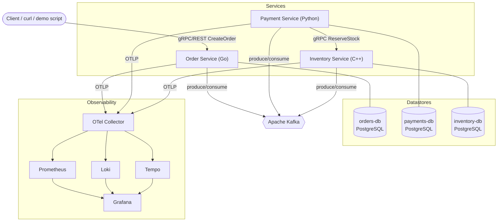
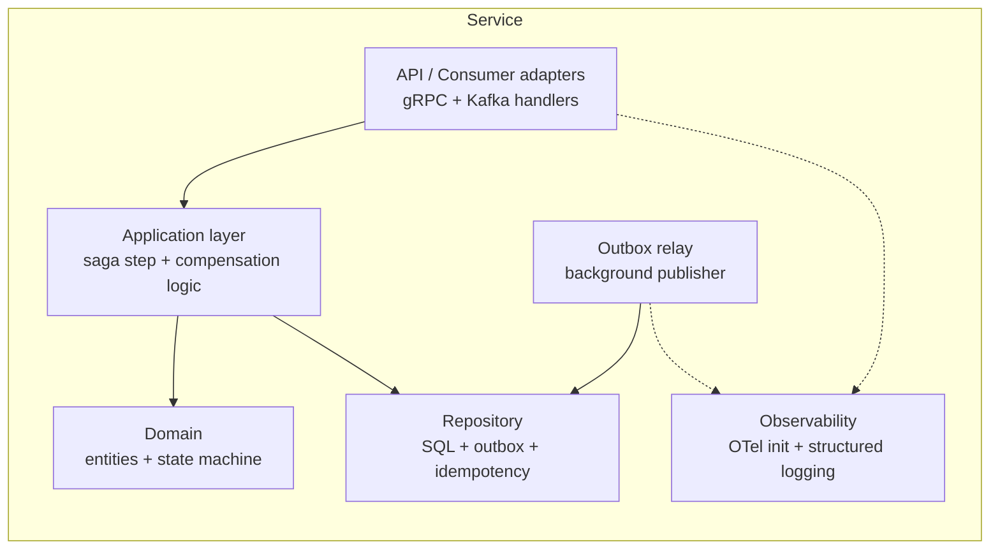
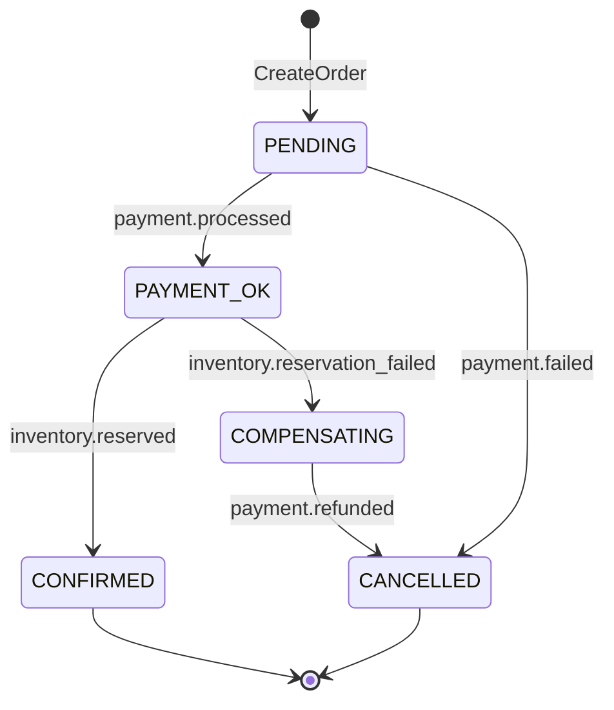

# Architecture Design Document

## Choreography Saga Demo

| Field | Value |
| --- | --- |
| Project | ChoreographySagaDemo |
| Document type | Design Document Specification |
| Author | System Architect |
| Status | Approved for Developer hand-off |
| Date | 2026-09-26 |
| Sources | `docs/requirements/SRS.md`, `docs/tech-stack.md` |

> Interfaces, diagrams, and data models only — no implementation code. Requirement IDs in
> parentheses map each design element back to the SRS.

---

## 1. System Context (FR-1, FR-2, C-9, C-10)

A client triggers an order; three autonomous services choreograph a distributed transaction
over Kafka, with one synchronous gRPC leg, each owning a private PostgreSQL database. A shared
observability stack collects metrics, logs, and traces.



---

## 2. Service Boundaries & Ownership (FR-1, FR-14)

| Service | Language | Owns | Publishes | Consumes | Sync API |
| --- | --- | --- | --- | --- | --- |
| **Order** | Go | orders, saga state | `order.created`, `order.cancelled` | `payment.processed`, `payment.failed`, `inventory.reserved`, `inventory.reservation_failed`, `payment.refunded` | gRPC/REST `CreateOrder`, `GetOrder` (inbound) |
| **Payment** | Python | payments | `payment.processed`, `payment.failed`, `payment.refunded` | `order.created`, `inventory.reservation_failed` | gRPC client → Inventory |
| **Inventory** | C++ | stock, reservations | `inventory.reserved`, `inventory.reservation_failed` | `payment.processed` (drives ReserveStock) | gRPC server `ReserveStock`, `ReleaseStock` (inbound) |

Each service additionally owns its **outbox** and **processed_messages** tables (FR-9, FR-12).

---

## 3. Per-Service Internal Component Layout

Common internal shape (clean-architecture layering, DI-friendly for testability — testability
check per Architect workflow):



- **API/Consumer adapters** — inbound gRPC handlers, Kafka consumers (manual offset commit).
- **Application layer** — executes the saga step and its compensation; wraps business write +
  outbox insert in one transaction (FR-9).
- **Domain** — entity + explicit state machine (§5).
- **Repository** — PostgreSQL access, outbox, idempotency dedupe (§8 of tech-stack).
- **Outbox relay** — background loop publishing PENDING rows (FR-10, FR-11).
- **Observability** — OTel SDK init, propagators, structured JSON logging with `trace_id`.

Boundaries are interfaces (Go interfaces / Python protocols / C++ abstract classes) so unit
tests inject fakes for repo and Kafka without heavy mocking.

---

## 4. Data Model Per Service (FR-8, FR-14)

### 4.1 Order (orders-db)

`orders`

| Column | Type | Notes |
| --- | --- | --- |
| `id` (=saga_id) | UUID PK | |
| `customer_id` | TEXT | |
| `sku` | TEXT | |
| `quantity` | INT | |
| `amount` | NUMERIC | forced-failure magic value `66.06` (§10 tech-stack) |
| `status` | TEXT | saga state machine (§5) |
| `payment_id` | UUID NULL | learned from `payment.processed` |
| `reservation_id` | UUID NULL | learned from `inventory.reserved` |
| `created_at`/`updated_at` | TIMESTAMPTZ | |

Plus `outbox` and `processed_messages` (schemas in tech-stack §8).

### 4.2 Payment (payments-db)

`payments`

| Column | Type | Notes |
| --- | --- | --- |
| `id` | UUID PK | |
| `saga_id` | UUID | == order id |
| `amount` | NUMERIC | |
| `status` | TEXT | `PROCESSED` / `FAILED` / `REFUNDED` |
| `created_at` | TIMESTAMPTZ | |

Plus `outbox`, `processed_messages`.

### 4.3 Inventory (inventory-db)

`stock`

| Column | Type | Notes |
| --- | --- | --- |
| `sku` | TEXT PK | |
| `available` | INT | decremented on reserve |
| `reserved` | INT | |

`reservations`

| Column | Type | Notes |
| --- | --- | --- |
| `id` (=reservation_id) | UUID PK | |
| `saga_id` | UUID | |
| `sku` | TEXT | |
| `quantity` | INT | |
| `status` | TEXT | `RESERVED` / `RELEASED` |

Plus `outbox`, `processed_messages`.

### 4.4 Saga state (co-located in Order)

Saga state is the `orders.status` field driven by consumed events; there is **no separate saga
store or orchestrator** (FR-2). Each service's local status columns are its own saga-step
record (FR-8).

---

## 5. Order State Machine (FR-4, FR-6, FR-7)



`CONFIRMED` and `CANCELLED` are terminal (FR-6, FR-7, AC-1, AC-5).

---

## 6. Choreography Event Flow — Happy Path (FR-5, FR-6, AC-1)

1. Client → Order `CreateOrder`: persist `orders(PENDING)` + outbox `OrderCreated` in one tx →
   relay publishes `order.created`.
2. Payment consumes `order.created`: charges (simulated), persists `payments(PROCESSED)` +
   outbox `PaymentProcessed` → publishes `payment.processed`.
3. Inventory consumes `payment.processed` → **but the actual reservation is the synchronous
   gRPC `ReserveStock` call** (see §7). On success persists `reservations(RESERVED)` + outbox
   `InventoryReserved` → publishes `inventory.reserved`.
4. Order consumes `inventory.reserved` → `orders.status = CONFIRMED` (terminal).

## 7. gRPC Call Placement (FR-15, FR-16, C-10)

The **Payment service** makes the synchronous **`Inventory.ReserveStock`** gRPC call after a
successful charge, using the typed outcome to decide the next event:

- `RESERVED` → Payment/Inventory path continues; Inventory emits `inventory.reserved`.
- `INSUFFICIENT_STOCK` → Inventory emits `inventory.reservation_failed`, triggering compensation.

> Design note: the reservation write and its `InventoryReserved` outbox record are owned by
> Inventory (it owns stock, FR-14). The gRPC call is the synchronous request/response leg
> (C-10); the resulting event keeps the flow choreographed (FR-2). This is the single sync hop
> — all other coordination is event-driven.

---

## 8. Compensation Flow — Reverse Order (FR-3, FR-7, FR-19, FR-21, AC-4, AC-5)

Triggered by `payment.failed` (payment-stage failure) or `inventory.reservation_failed`
(inventory-stage failure). Compensations run in **reverse** of completed steps:

| Failure point | Completed steps to undo (reverse order) | Compensation events |
| --- | --- | --- |
| Payment fails | (none downstream) → cancel order | `payment.failed` → `order.cancelled` |
| Inventory fails | 1. refund payment, 2. cancel order | `inventory.reservation_failed` → `payment.refunded` → `order.cancelled` |

- Inventory failure ⇒ Payment consumes `inventory.reservation_failed`, refunds
  (`payments.status=REFUNDED`) + outbox `PaymentRefunded` → `payment.refunded`.
- Order consumes `payment.refunded` (or `payment.failed`) → `orders.status = CANCELLED`,
  outbox `OrderCancelled` → `order.cancelled`.
- If stock was reserved before a later failure, Inventory `ReleaseStock` restores it
  (`reservations.status=RELEASED`), returning to a no-residue consistent state (FR-21, AC-5).

Rollback is observable in logs + a single trace (FR-20, AC-6) because every step carries the
`sagaId` and W3C trace context (tech-stack §9.2).

---

## 9. Topic Produce/Consume Matrix (FR-17, FR-18)

| Topic | Produced by | Consumed by | Triggers |
| --- | --- | --- | --- |
| `order.created` | Order | Payment | attempt payment |
| `payment.processed` | Payment | Inventory, Order | Inventory: ReserveStock; Order: → PAYMENT_OK |
| `payment.failed` | Payment | Order | Order → CANCELLED |
| `inventory.reserved` | Inventory | Order | Order → CONFIRMED |
| `inventory.reservation_failed` | Inventory | Payment, Order | Payment: refund; Order → COMPENSATING |
| `payment.refunded` | Payment | Order | Order → CANCELLED |
| `order.cancelled` | Order | (terminal / observability) | saga end |

---

## 10. Repository / Directory Layout (Monorepo) (NFR-5, C-12…C-16)

```text
ChoreographySagaDemo/
├── LICENSE
├── README.md
├── Makefile                      # buf gen, build-all, up, demo, force-failure
├── buf.yaml / buf.gen.yaml       # proto lint + multi-language codegen
├── proto/                        # single source of truth for gRPC contracts
│   ├── order/v1/order.proto
│   └── inventory/v1/inventory.proto
├── services/
│   ├── order/                    # Go
│   │   ├── cmd/ internal/ ...
│   │   ├── migrations/
│   │   ├── go.mod
│   │   └── Dockerfile            # multi-stage (C-12)
│   ├── payment/                  # Python
│   │   ├── src/payment/ tests/
│   │   ├── migrations/           # Alembic
│   │   ├── pyproject.toml
│   │   └── Dockerfile            # multi-stage (C-12)
│   └── inventory/                # C++
│       ├── src/ include/ test/
│       ├── migrations/
│       ├── CMakeLists.txt vcpkg.json
│       └── Dockerfile            # multi-stage (C-12)
├── deploy/
│   ├── compose/docker-compose.yml        # full local stack (C-13, NFR-5)
│   ├── helm/choreography-saga/           # Helm chart (C-14)
│   └── k8s/                               # raw manifests (C-15)
├── observability/
│   ├── otel-collector/config.yaml
│   ├── prometheus/prometheus.yml + rules/ # alert rules (C-8, FR-25)
│   ├── loki/  tempo/
│   └── grafana/provisioning/{datasources,dashboards}/   # incl. SLO dashboard
├── scripts/
│   ├── run-demo.sh
│   └── force-failure.sh                   # forced-failure trigger (FR-19)
└── docs/
    ├── requirements/SRS.md
    ├── tech-stack.md
    └── design/
        ├── ARCHITECTURE.md
        └── sequence-diagram.md
```

---

## 11. Testability (Architect workflow check)

- Repositories, Kafka producer/consumer, and the Inventory gRPC client sit behind interfaces →
  unit-testable with in-memory fakes (no broker/DB needed for logic tests).
- Idempotency and outbox are DB-backed and covered by integration tests (AC-8, AC-9) using
  Testcontainers-style ephemeral Postgres/Kafka.
- Forced-failure is deterministic (magic amount / env flag) enabling automated compensation
  tests (AC-4).

---

## 12. Risks

| Risk | Impact | Mitigation |
| --- | --- | --- |
| C++ toolchain (gRPC + librdkafka + opentelemetry-cpp via vcpkg) is the heaviest build | Slows Inventory delivery | Keep Inventory surface minimal (1 RPC + 1 consumer + 1 compensation); pin vcpkg baseline |
| Polling outbox adds latency | Higher saga completion time | Short poll interval; SLO set to demo-tolerant 2s p95 |
| Single partition limits throughput | Not a demo concern | Documented; multi-partition is future work (OOS-5) |
| OTel C++ logs less mature than Go/Python | Uneven log correlation | Ensure structured JSON + trace_id manually in C++ logger |
| JSON events lack registry governance | Schema drift | `schemaVersion` field + documented versioning rule (tech-stack §5.2) |

---

## 13. Flagged Back to Requirements Analyst

No new requirements were invented. One clarification worth noting (non-blocking): the SRS lists
`InventoryReservationFailed` but the reverse-compensation also needs an explicit
`InventoryReleased`/`ReleaseStock` action — captured here as the gRPC `ReleaseStock` +
`reservations.status=RELEASED` (consistent with FR-3). No scope expansion.
