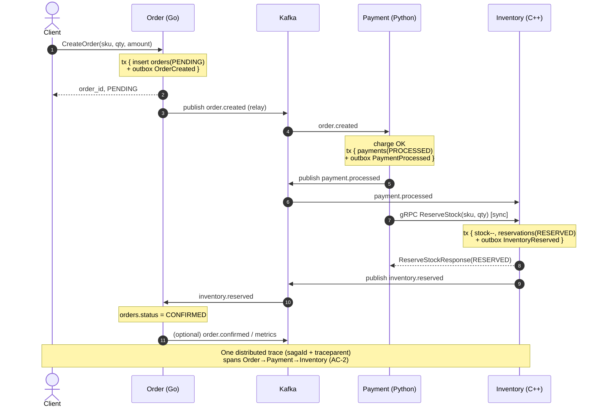
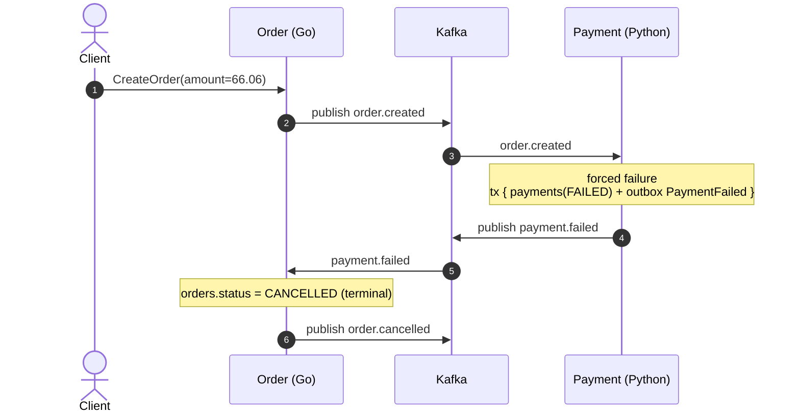

# Sequence Diagrams

## Choreography Saga Demo

| Field | Value |
| --- | --- |
| Project | ChoreographySagaDemo |
| Author | System Architect |
| Status | Approved for Developer hand-off |
| Date | 2026-09-26 |
| Satisfies | C-16, FR-5, FR-7, AC-1, AC-4, AC-13 |

> Covers **both** the happy path and the compensation (forced-failure rollback) path (C-16,
> AC-13). The Technical Writer will later reference/polish these.

---

## 1. Happy Path (FR-5, FR-6, AC-1, AC-2)



---

## 2. Compensation Path — Forced Failure Rollback (FR-7, FR-19, FR-21, AC-4, AC-5, AC-6)

Scenario: inventory-stage failure (poison SKU `SKU-DEADBEEF` → `INSUFFICIENT_STOCK`),
exercising the full reverse chain: **release stock → refund payment → cancel order**.

```mermaid
sequenceDiagram
    autonumber
    actor Client
    participant Order as Order (Go)
    participant Kafka as Kafka
    participant Payment as Payment (Python)
    participant Inventory as Inventory (C++)

    Client->>Order: CreateOrder(sku=SKU-DEADBEEF, qty, amount)
    Note over Order: tx { orders(PENDING) + outbox OrderCreated }
    Order->>Kafka: publish order.created

    Kafka->>Payment: order.created
    Note over Payment: charge OK<br/>tx { payments(PROCESSED) + outbox PaymentProcessed }
    Payment->>Kafka: publish payment.processed

    Kafka->>Inventory: payment.processed
    Payment->>Inventory: gRPC ReserveStock(SKU-DEADBEEF) [sync]
    Note over Inventory: insufficient stock
    Inventory-->>Payment: ReserveStockResponse(INSUFFICIENT_STOCK)
    Inventory->>Kafka: publish inventory.reservation_failed

    rect rgb(255, 235, 235)
    Note over Payment,Order: COMPENSATION (reverse order)
    Kafka->>Payment: inventory.reservation_failed
    Note over Payment: tx { payments(REFUNDED) + outbox PaymentRefunded }
    Payment->>Kafka: publish payment.refunded

    Kafka->>Order: payment.refunded
    Note over Order: orders.status = CANCELLED (terminal)
    Order->>Kafka: publish order.cancelled
    end

    Note over Client,Inventory: Rollback observable end-to-end in logs + one trace<br/>trace-to-log correlation (AC-6); no residual stock/payment (AC-5)
```

### 2.1 Alternate trigger — payment-stage failure (FR-19, §10 tech-stack)

If the forced failure is at the payment stage (amount `66.06` or `FORCE_PAYMENT_FAILURE=true`),
the chain is shorter (nothing downstream to undo):



---

## 3. Notes

- Every `publish` is performed by the **outbox relay** after a committed local transaction
  (FR-9, FR-10, AC-8); the diagrams collapse insert+relay for readability.
- Every consume path is **idempotent** via `processed_messages` dedupe (FR-12, AC-9).
- `sagaId` (== `orderId`) and W3C `traceparent` propagate on every Kafka event header and the
  gRPC call, yielding a single end-to-end trace (FR-23, AC-2, AC-6).
